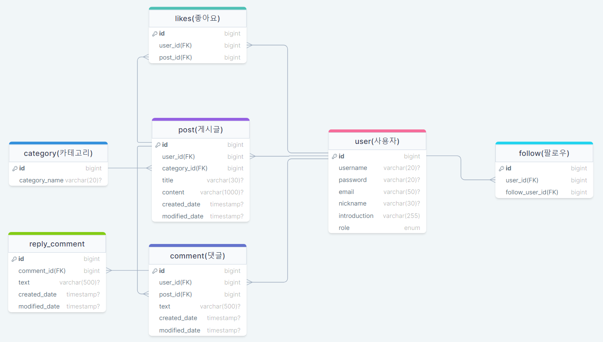
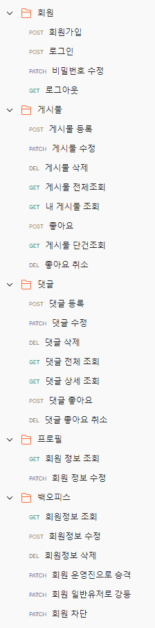

## 🎄 프로젝트 소개

- 스파르타 사람들이 익명으로 자유롭게 이야기 할 수 있는 곳!

## 🎄 프로젝트 목표

- 강의를 통해 배웠던 기능들을 알맞게 조합하여 직접 구현
- 협업을 통한 미래에 개발자로서의 소통 능력 향상
- 협업 시 필요한 깃 컨벤션 및 전략 등을 정하여 코드의 재사용성 향상
- 개발 단계에서 서로 알게 된 점을 공유하면서 강의에서 미처 배우지 못한 기능 및 지식들을 배워 개발 역량 증진

---
## 🎄 준비사항
### 🎄Git convention
- feat : 새로운 기능 추가
- hotfix : 급하게 치명적인 버그 수정
- docs : 문서 수정
- fix : 코드 수정
- style : 코드 포맷팅(code formatting), 세미콜론(;) 등의 스타일 수정 (코드 자체 수정 X)
- refactor : 프로덕션 코드 리팩토링
- test : 테스트 코드, 테스트 코드 리팩토링
- chore : 빌드 과정 또는 보조 기능(문서 생성 기능 등) 수정
- rename : 파일 혹은 폴더명을 수정하거나 옮기는 작업만인 경우
- comment : 필요한 주석 추가 및 번경

### 🎄 Git branch 전략
● 메인브랜치(main branch)
- master : 제품으로 출시될 수 있는 브랜치
- develop : 다음 출시 버전을 개발하는 브랜치

● 보조 브랜치(sub branch)
- feature : develop 브랜치에 새로 추가할 기능을 개발하는 브랜치
- release : develop 브랜치 개발이 완료되면 출시버전을 준비하면서 QA, TEST를 위해서 사용하는 임시 브랜치
- hotfix : 마스터 브랜치(master branch)에서 발생한 버그를 수정하는 브랜치
---

### 🎄 ERD

---
### 🎄 API 명세
https://documenter.getpostman.com/view/31047587/2s9YeLYppA#7c53b5af-cea8-43f3-915d-97a4203f76e0

